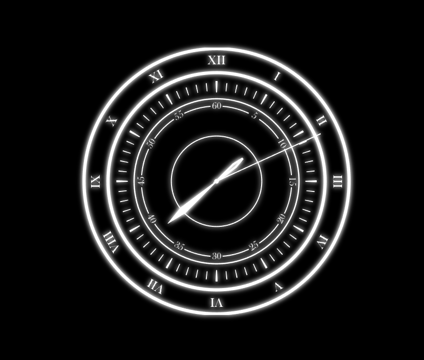

# ClockParadox
一个仿照音游Phigros第七章魔王曲解锁动画中出现的钟表的KDE小部件。

## Install
```bash
git clone https://github.com/kvarenzn/ClockParadox.git
cd ClockParadox
kpackagetool -t Plasma/Applet --install plasmoid
```

## Preview
```bash
plasmoidviewer --applet kvarenzn.clockparadox
```

## Upgrade
```bash
cd ClockParadox
git pull
kpackagetool -t Plasma/Applet --upgrade plasmoid
```

## Uninstall
```bash
cd ~/.local/share/plasma/plasmoids/
rm -rf kvarenzn.clockparadox/
```

## Configure
右键小部件可以进行配置。目前可以配置的项包括字体和辉光效果。

推荐安装并设置字体为`Baskerville Old Face`

## Screenshots


